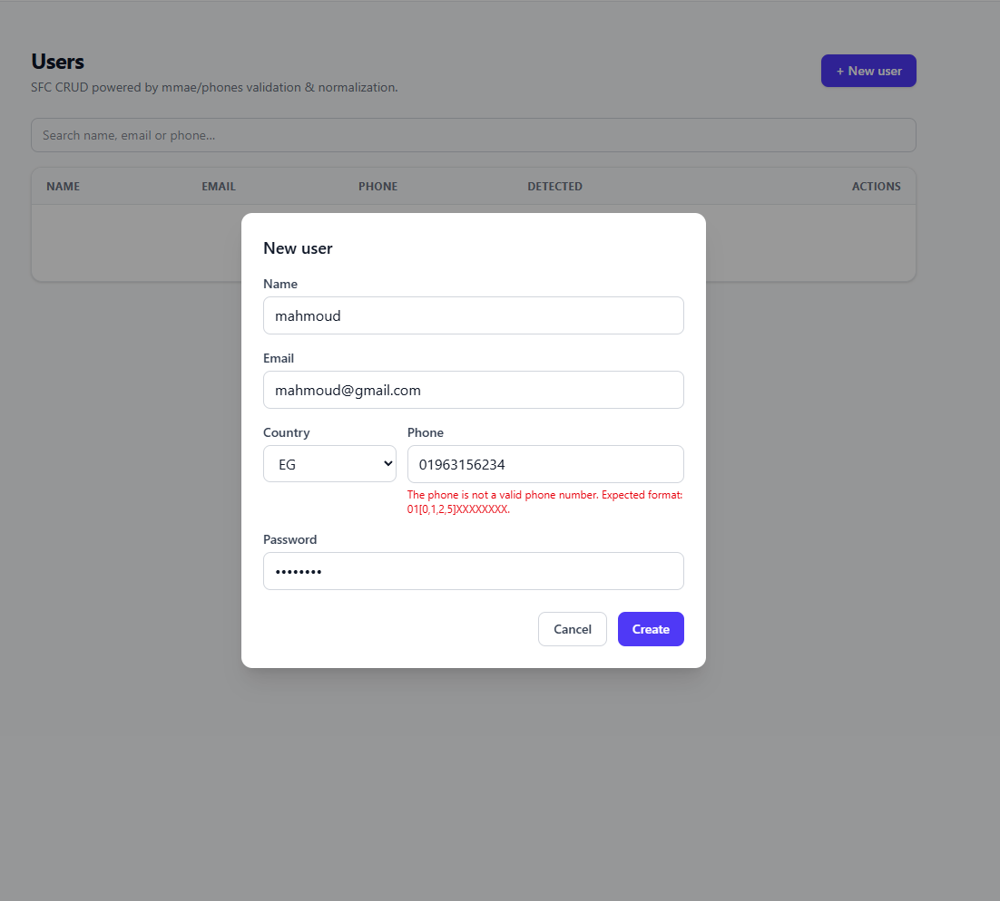
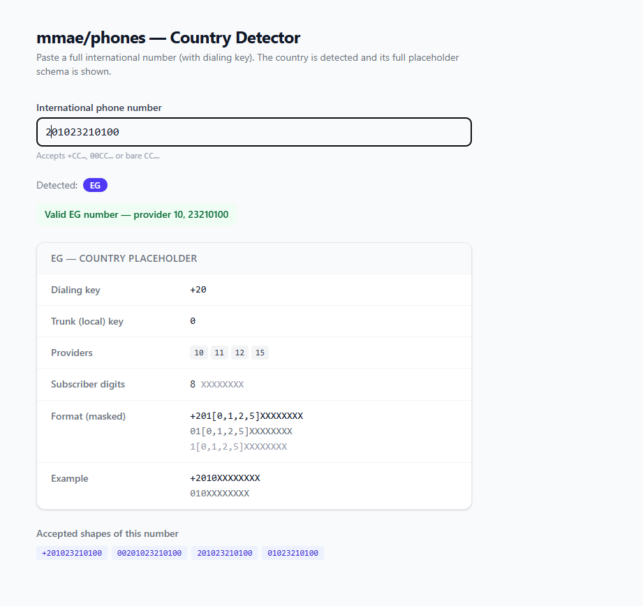
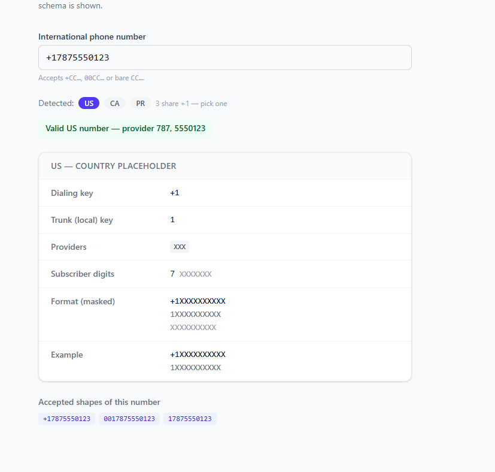
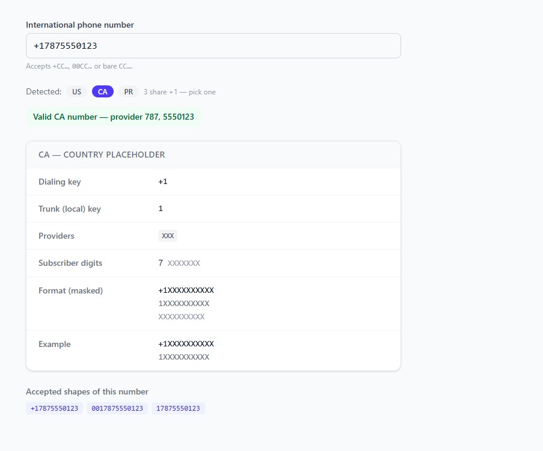
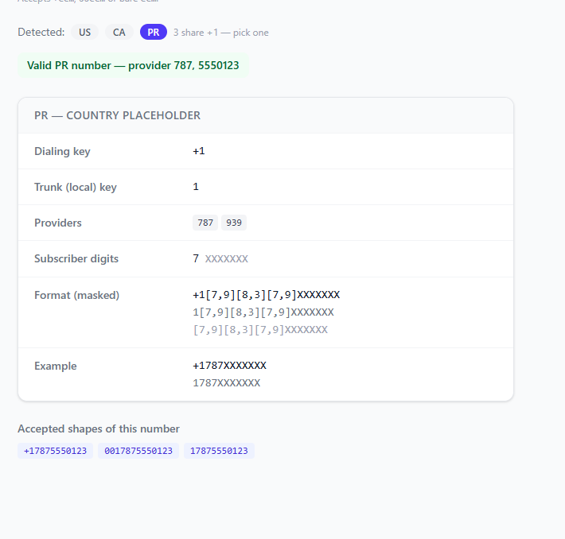

# mmae/phones

Laravel package for validating and normalizing phone numbers, with a matching set of validation rules.

- **209 countries** — one `{CODE}Phone` class and one `{CODE}PhoneRule` per entry in `config/phones.php`.
- Normalizes any accepted shape (local `0`, `00`, `+`, bare dialing code) to a single canonical form.
- Drop-in Laravel `ValidationRule`s with `exists`/`unique` database checks, nullable/empty handling, custom messages, translations, and a full-control callback.

## 1. Supported Countries

**209 countries**, each with the full feature set. Every entry in `config/phones.php` ships all four of:

- **Phone** — a `{CODE}Phone` class (`MMAE\Phones\Phones\`) for validation/normalization (§3, §5).
- **Rule** — a `{CODE}PhoneRule` validation rule (`MMAE\Phones\Rules\`, §4).
- **Placeholder** — a `{CODE}Placeholder` for UI hints/masks (`MMAE\Phones\Placeholders\`, §7).
- **Detector** — `CountryDetector` support (§6), enabled whenever the config entry has a `key` and `pattern`.

Legend: ✅ supported · — not generated.

> All 209 bundled countries are ✅ across every column. The columns matter once you **extend the config yourself**: a country you add to `config/phones.php` gets **Detector** support immediately (it reads config directly), but its `{CODE}Phone` / `{CODE}PhoneRule` / `{CODE}Placeholder` classes only exist after you add them (§8 → *Adding a new country*). Run `php artisan config:show phones` to list your live codes.

<details>
<summary><strong>Full support matrix (209 countries)</strong></summary>

| Country | Code | Phone | Rule | Placeholder | Detector |
|---|---|:-:|:-:|:-:|:-:|
| Andorra | `AD` | ✅ | ✅ | ✅ | ✅ |
| United Arab Emirates | `AE` | ✅ | ✅ | ✅ | ✅ |
| Afghanistan | `AF` | ✅ | ✅ | ✅ | ✅ |
| Antigua & Barbuda | `AG` | ✅ | ✅ | ✅ | ✅ |
| Anguilla | `AI` | ✅ | ✅ | ✅ | ✅ |
| Albania | `AL` | ✅ | ✅ | ✅ | ✅ |
| Armenia | `AM` | ✅ | ✅ | ✅ | ✅ |
| Angola | `AO` | ✅ | ✅ | ✅ | ✅ |
| Argentina | `AR` | ✅ | ✅ | ✅ | ✅ |
| American Samoa | `AS` | ✅ | ✅ | ✅ | ✅ |
| Austria | `AT` | ✅ | ✅ | ✅ | ✅ |
| Australia | `AU` | ✅ | ✅ | ✅ | ✅ |
| Azerbaijan | `AZ` | ✅ | ✅ | ✅ | ✅ |
| Bosnia & Herzegovina | `BA` | ✅ | ✅ | ✅ | ✅ |
| Barbados | `BB` | ✅ | ✅ | ✅ | ✅ |
| Bangladesh | `BD` | ✅ | ✅ | ✅ | ✅ |
| Belgium | `BE` | ✅ | ✅ | ✅ | ✅ |
| Burkina Faso | `BF` | ✅ | ✅ | ✅ | ✅ |
| Bulgaria | `BG` | ✅ | ✅ | ✅ | ✅ |
| Bahrain | `BH` | ✅ | ✅ | ✅ | ✅ |
| Burundi | `BI` | ✅ | ✅ | ✅ | ✅ |
| Benin | `BJ` | ✅ | ✅ | ✅ | ✅ |
| Bermuda | `BM` | ✅ | ✅ | ✅ | ✅ |
| Brunei | `BN` | ✅ | ✅ | ✅ | ✅ |
| Bolivia | `BO` | ✅ | ✅ | ✅ | ✅ |
| Brazil | `BR` | ✅ | ✅ | ✅ | ✅ |
| Bahamas | `BS` | ✅ | ✅ | ✅ | ✅ |
| Bhutan | `BT` | ✅ | ✅ | ✅ | ✅ |
| Botswana | `BW` | ✅ | ✅ | ✅ | ✅ |
| Belarus | `BY` | ✅ | ✅ | ✅ | ✅ |
| Belize | `BZ` | ✅ | ✅ | ✅ | ✅ |
| Canada | `CA` | ✅ | ✅ | ✅ | ✅ |
| Congo - Kinshasa | `CD` | ✅ | ✅ | ✅ | ✅ |
| Central African Republic | `CF` | ✅ | ✅ | ✅ | ✅ |
| Congo - Brazzaville | `CG` | ✅ | ✅ | ✅ | ✅ |
| Switzerland | `CH` | ✅ | ✅ | ✅ | ✅ |
| Côte d’Ivoire | `CI` | ✅ | ✅ | ✅ | ✅ |
| Chile | `CL` | ✅ | ✅ | ✅ | ✅ |
| Cameroon | `CM` | ✅ | ✅ | ✅ | ✅ |
| China | `CN` | ✅ | ✅ | ✅ | ✅ |
| Colombia | `CO` | ✅ | ✅ | ✅ | ✅ |
| Costa Rica | `CR` | ✅ | ✅ | ✅ | ✅ |
| Cuba | `CU` | ✅ | ✅ | ✅ | ✅ |
| Cape Verde | `CV` | ✅ | ✅ | ✅ | ✅ |
| Cyprus | `CY` | ✅ | ✅ | ✅ | ✅ |
| Czechia | `CZ` | ✅ | ✅ | ✅ | ✅ |
| Germany | `DE` | ✅ | ✅ | ✅ | ✅ |
| Djibouti | `DJ` | ✅ | ✅ | ✅ | ✅ |
| Denmark | `DK` | ✅ | ✅ | ✅ | ✅ |
| Dominica | `DM` | ✅ | ✅ | ✅ | ✅ |
| Dominican Republic | `DO` | ✅ | ✅ | ✅ | ✅ |
| Algeria | `DZ` | ✅ | ✅ | ✅ | ✅ |
| Ecuador | `EC` | ✅ | ✅ | ✅ | ✅ |
| Estonia | `EE` | ✅ | ✅ | ✅ | ✅ |
| Egypt | `EG` | ✅ | ✅ | ✅ | ✅ |
| Eritrea | `ER` | ✅ | ✅ | ✅ | ✅ |
| Spain | `ES` | ✅ | ✅ | ✅ | ✅ |
| Ethiopia | `ET` | ✅ | ✅ | ✅ | ✅ |
| Finland | `FI` | ✅ | ✅ | ✅ | ✅ |
| Fiji | `FJ` | ✅ | ✅ | ✅ | ✅ |
| Faroe Islands | `FO` | ✅ | ✅ | ✅ | ✅ |
| France | `FR` | ✅ | ✅ | ✅ | ✅ |
| Gabon | `GA` | ✅ | ✅ | ✅ | ✅ |
| United Kingdom | `GB` | ✅ | ✅ | ✅ | ✅ |
| Grenada | `GD` | ✅ | ✅ | ✅ | ✅ |
| Georgia | `GE` | ✅ | ✅ | ✅ | ✅ |
| Ghana | `GH` | ✅ | ✅ | ✅ | ✅ |
| Gibraltar | `GI` | ✅ | ✅ | ✅ | ✅ |
| Greenland | `GL` | ✅ | ✅ | ✅ | ✅ |
| Gambia | `GM` | ✅ | ✅ | ✅ | ✅ |
| Guinea | `GN` | ✅ | ✅ | ✅ | ✅ |
| Equatorial Guinea | `GQ` | ✅ | ✅ | ✅ | ✅ |
| Greece | `GR` | ✅ | ✅ | ✅ | ✅ |
| Guatemala | `GT` | ✅ | ✅ | ✅ | ✅ |
| Guam | `GU` | ✅ | ✅ | ✅ | ✅ |
| Guinea-Bissau | `GW` | ✅ | ✅ | ✅ | ✅ |
| Guyana | `GY` | ✅ | ✅ | ✅ | ✅ |
| Hong Kong SAR China | `HK` | ✅ | ✅ | ✅ | ✅ |
| Honduras | `HN` | ✅ | ✅ | ✅ | ✅ |
| Croatia | `HR` | ✅ | ✅ | ✅ | ✅ |
| Haiti | `HT` | ✅ | ✅ | ✅ | ✅ |
| Hungary | `HU` | ✅ | ✅ | ✅ | ✅ |
| Indonesia | `ID` | ✅ | ✅ | ✅ | ✅ |
| Ireland | `IE` | ✅ | ✅ | ✅ | ✅ |
| Israel | `IL` | ✅ | ✅ | ✅ | ✅ |
| India | `IN` | ✅ | ✅ | ✅ | ✅ |
| Iraq | `IQ` | ✅ | ✅ | ✅ | ✅ |
| Iran | `IR` | ✅ | ✅ | ✅ | ✅ |
| Iceland | `IS` | ✅ | ✅ | ✅ | ✅ |
| Italy | `IT` | ✅ | ✅ | ✅ | ✅ |
| Jamaica | `JM` | ✅ | ✅ | ✅ | ✅ |
| Jordan | `JO` | ✅ | ✅ | ✅ | ✅ |
| Japan | `JP` | ✅ | ✅ | ✅ | ✅ |
| Kenya | `KE` | ✅ | ✅ | ✅ | ✅ |
| Kyrgyzstan | `KG` | ✅ | ✅ | ✅ | ✅ |
| Cambodia | `KH` | ✅ | ✅ | ✅ | ✅ |
| Comoros | `KM` | ✅ | ✅ | ✅ | ✅ |
| St. Kitts & Nevis | `KN` | ✅ | ✅ | ✅ | ✅ |
| North Korea | `KP` | ✅ | ✅ | ✅ | ✅ |
| South Korea | `KR` | ✅ | ✅ | ✅ | ✅ |
| Kuwait | `KW` | ✅ | ✅ | ✅ | ✅ |
| Cayman Islands | `KY` | ✅ | ✅ | ✅ | ✅ |
| Kazakhstan | `KZ` | ✅ | ✅ | ✅ | ✅ |
| Laos | `LA` | ✅ | ✅ | ✅ | ✅ |
| Lebanon | `LB` | ✅ | ✅ | ✅ | ✅ |
| St. Lucia | `LC` | ✅ | ✅ | ✅ | ✅ |
| Liechtenstein | `LI` | ✅ | ✅ | ✅ | ✅ |
| Sri Lanka | `LK` | ✅ | ✅ | ✅ | ✅ |
| Liberia | `LR` | ✅ | ✅ | ✅ | ✅ |
| Lesotho | `LS` | ✅ | ✅ | ✅ | ✅ |
| Lithuania | `LT` | ✅ | ✅ | ✅ | ✅ |
| Luxembourg | `LU` | ✅ | ✅ | ✅ | ✅ |
| Latvia | `LV` | ✅ | ✅ | ✅ | ✅ |
| Libya | `LY` | ✅ | ✅ | ✅ | ✅ |
| Morocco | `MA` | ✅ | ✅ | ✅ | ✅ |
| Monaco | `MC` | ✅ | ✅ | ✅ | ✅ |
| Moldova | `MD` | ✅ | ✅ | ✅ | ✅ |
| Montenegro | `ME` | ✅ | ✅ | ✅ | ✅ |
| Madagascar | `MG` | ✅ | ✅ | ✅ | ✅ |
| North Macedonia | `MK` | ✅ | ✅ | ✅ | ✅ |
| Mali | `ML` | ✅ | ✅ | ✅ | ✅ |
| Myanmar (Burma) | `MM` | ✅ | ✅ | ✅ | ✅ |
| Mongolia | `MN` | ✅ | ✅ | ✅ | ✅ |
| Macao SAR China | `MO` | ✅ | ✅ | ✅ | ✅ |
| Northern Mariana Islands | `MP` | ✅ | ✅ | ✅ | ✅ |
| Mauritania | `MR` | ✅ | ✅ | ✅ | ✅ |
| Montserrat | `MS` | ✅ | ✅ | ✅ | ✅ |
| Malta | `MT` | ✅ | ✅ | ✅ | ✅ |
| Mauritius | `MU` | ✅ | ✅ | ✅ | ✅ |
| Maldives | `MV` | ✅ | ✅ | ✅ | ✅ |
| Malawi | `MW` | ✅ | ✅ | ✅ | ✅ |
| Mexico | `MX` | ✅ | ✅ | ✅ | ✅ |
| Malaysia | `MY` | ✅ | ✅ | ✅ | ✅ |
| Mozambique | `MZ` | ✅ | ✅ | ✅ | ✅ |
| Namibia | `NA` | ✅ | ✅ | ✅ | ✅ |
| New Caledonia | `NC` | ✅ | ✅ | ✅ | ✅ |
| Niger | `NE` | ✅ | ✅ | ✅ | ✅ |
| Nigeria | `NG` | ✅ | ✅ | ✅ | ✅ |
| Nicaragua | `NI` | ✅ | ✅ | ✅ | ✅ |
| Netherlands | `NL` | ✅ | ✅ | ✅ | ✅ |
| Norway | `NO` | ✅ | ✅ | ✅ | ✅ |
| Nepal | `NP` | ✅ | ✅ | ✅ | ✅ |
| New Zealand | `NZ` | ✅ | ✅ | ✅ | ✅ |
| Oman | `OM` | ✅ | ✅ | ✅ | ✅ |
| Panama | `PA` | ✅ | ✅ | ✅ | ✅ |
| Peru | `PE` | ✅ | ✅ | ✅ | ✅ |
| French Polynesia | `PF` | ✅ | ✅ | ✅ | ✅ |
| Papua New Guinea | `PG` | ✅ | ✅ | ✅ | ✅ |
| Philippines | `PH` | ✅ | ✅ | ✅ | ✅ |
| Pakistan | `PK` | ✅ | ✅ | ✅ | ✅ |
| Poland | `PL` | ✅ | ✅ | ✅ | ✅ |
| Puerto Rico | `PR` | ✅ | ✅ | ✅ | ✅ |
| Palestinian Territories | `PS` | ✅ | ✅ | ✅ | ✅ |
| Portugal | `PT` | ✅ | ✅ | ✅ | ✅ |
| Paraguay | `PY` | ✅ | ✅ | ✅ | ✅ |
| Qatar | `QA` | ✅ | ✅ | ✅ | ✅ |
| Romania | `RO` | ✅ | ✅ | ✅ | ✅ |
| Serbia | `RS` | ✅ | ✅ | ✅ | ✅ |
| Russia | `RU` | ✅ | ✅ | ✅ | ✅ |
| Rwanda | `RW` | ✅ | ✅ | ✅ | ✅ |
| Saudi Arabia | `SA` | ✅ | ✅ | ✅ | ✅ |
| Solomon Islands | `SB` | ✅ | ✅ | ✅ | ✅ |
| Seychelles | `SC` | ✅ | ✅ | ✅ | ✅ |
| Sudan | `SD` | ✅ | ✅ | ✅ | ✅ |
| Sweden | `SE` | ✅ | ✅ | ✅ | ✅ |
| Singapore | `SG` | ✅ | ✅ | ✅ | ✅ |
| Slovenia | `SI` | ✅ | ✅ | ✅ | ✅ |
| Slovakia | `SK` | ✅ | ✅ | ✅ | ✅ |
| Sierra Leone | `SL` | ✅ | ✅ | ✅ | ✅ |
| San Marino | `SM` | ✅ | ✅ | ✅ | ✅ |
| Senegal | `SN` | ✅ | ✅ | ✅ | ✅ |
| Somalia | `SO` | ✅ | ✅ | ✅ | ✅ |
| Suriname | `SR` | ✅ | ✅ | ✅ | ✅ |
| South Sudan | `SS` | ✅ | ✅ | ✅ | ✅ |
| São Tomé & Príncipe | `ST` | ✅ | ✅ | ✅ | ✅ |
| El Salvador | `SV` | ✅ | ✅ | ✅ | ✅ |
| Sint Maarten | `SX` | ✅ | ✅ | ✅ | ✅ |
| Syria | `SY` | ✅ | ✅ | ✅ | ✅ |
| Eswatini | `SZ` | ✅ | ✅ | ✅ | ✅ |
| Turks & Caicos Islands | `TC` | ✅ | ✅ | ✅ | ✅ |
| Chad | `TD` | ✅ | ✅ | ✅ | ✅ |
| Togo | `TG` | ✅ | ✅ | ✅ | ✅ |
| Thailand | `TH` | ✅ | ✅ | ✅ | ✅ |
| Tajikistan | `TJ` | ✅ | ✅ | ✅ | ✅ |
| Timor-Leste | `TL` | ✅ | ✅ | ✅ | ✅ |
| Turkmenistan | `TM` | ✅ | ✅ | ✅ | ✅ |
| Tunisia | `TN` | ✅ | ✅ | ✅ | ✅ |
| Tonga | `TO` | ✅ | ✅ | ✅ | ✅ |
| Türkiye | `TR` | ✅ | ✅ | ✅ | ✅ |
| Trinidad & Tobago | `TT` | ✅ | ✅ | ✅ | ✅ |
| Taiwan | `TW` | ✅ | ✅ | ✅ | ✅ |
| Tanzania | `TZ` | ✅ | ✅ | ✅ | ✅ |
| Ukraine | `UA` | ✅ | ✅ | ✅ | ✅ |
| Uganda | `UG` | ✅ | ✅ | ✅ | ✅ |
| United States | `US` | ✅ | ✅ | ✅ | ✅ |
| Uruguay | `UY` | ✅ | ✅ | ✅ | ✅ |
| Uzbekistan | `UZ` | ✅ | ✅ | ✅ | ✅ |
| St. Vincent & Grenadines | `VC` | ✅ | ✅ | ✅ | ✅ |
| Venezuela | `VE` | ✅ | ✅ | ✅ | ✅ |
| British Virgin Islands | `VG` | ✅ | ✅ | ✅ | ✅ |
| U.S. Virgin Islands | `VI` | ✅ | ✅ | ✅ | ✅ |
| Vietnam | `VN` | ✅ | ✅ | ✅ | ✅ |
| Vanuatu | `VU` | ✅ | ✅ | ✅ | ✅ |
| Samoa | `WS` | ✅ | ✅ | ✅ | ✅ |
| Kosovo | `XK` | ✅ | ✅ | ✅ | ✅ |
| Yemen | `YE` | ✅ | ✅ | ✅ | ✅ |
| South Africa | `ZA` | ✅ | ✅ | ✅ | ✅ |
| Zambia | `ZM` | ✅ | ✅ | ✅ | ✅ |
| Zimbabwe | `ZW` | ✅ | ✅ | ✅ | ✅ |

</details>

## 2. Installation

```bash
composer require mmae/phones
```

Config and translations are merged/loaded automatically — no publish needed to start.

## 3. Usage

Pick the entry point by what you have:

- a **known** country → the `{CODE}Phone` class for normalization + a `{CODE}PhoneRule` for validation (below),
- a country that **varies per request** → the generic `Phone` / `PhoneRule` (below),
- an international number of **unknown** country → the **detector** (§6),
- a full form or Livewire UI → the **validation rules** (§4) and **Livewire examples** (§9).

### Validate a known-country number before saving

Prefer the rule (§4) in `validate()`; use the phone class to normalize before storing:

```php
<?php

use Illuminate\Http\Request;
use MMAE\Phones\Phones\EGPhone;
use MMAE\Phones\Rules\EGPhoneRule;

class UserController extends \App\Http\Controllers\Controller
{
    public function store(Request $request)
    {
        $data = $request->validate([
            'name' => 'required',
            // format check, plus optional exists()/unique() — see §4
            'phone' => ['required', EGPhoneRule::make()],
        ]);

        // normalize any accepted shape (local 0, 00, +, bare) to one canonical form
        $data['phone'] = EGPhone::make($data['phone'])->toString();
        \App\Models\User::create($data);

        return back()->with('success', 'created');
    }
}
```

Each country ships a class under `MMAE\Phones\Phones\` (`EGPhone`, `SAPhone`, `LYPhone`, `AEPhone`, …) and a matching rule under `MMAE\Phones\Rules\` (`EGPhoneRule`, …) — one of each per config entry. Without the rule you can still validate by hand: `if (EGPhone::make($data['phone'])->isNotValid()) { … }`.

### Validate when the country varies per user (multi-country registration)

Use the generic `Phone` / `PhoneRule` with an explicit `$countryCode` (a key in `config/phones.php`) instead of hardcoding one:

```php
use MMAE\Phones\Phone;

$phone = Phone::make($user->phone, $user->country_code);
if ($phone->isNotValid()) {
    throw new \Exception('wrong format');
}

// withPlus() flips the +-prefix flag; stringify to send the +CC… form
$SMSService->message('hello')->to($phone->withPlus()->toString())->send();
```

For a form where the country is itself a field, drop `PhoneRule::make($countryCode)` into your rules — see §4 and the Livewire form in §9.

## 4. Validation Rules

Every country also ships a `{CODE}PhoneRule` under `MMAE\Phones\Rules\`, implementing Laravel's `ValidationRule`. Use it directly in `$request->validate()` / `Validator::make()`.

```php
use MMAE\Phones\Rules\EGPhoneRule;

$request->validate([
    'phone' => ['required', EGPhoneRule::make()],
]);
```

The country locale is **locked** on a `{CODE}PhoneRule` — it can't be swapped at runtime (that's the point of a per-country class). When the country varies per request, use the generic `PhoneRule`, which takes an explicit code:

```php
use MMAE\Phones\Rules\PhoneRule;

$request->validate([
    'phone' => [PhoneRule::make($user->country_code)],
]);
```

### Fluent modifiers

All rules share the same chainable API (from `MMAE\Phones\Base\BasePhoneRule`):

| Method | Purpose |
|---|---|
| `make()` | fluent constructor (generic `PhoneRule::make($code)` takes the code) |
| `message(string $message)` | override the invalid-format message (literal or translation key) |
| `nullable(bool = true)` | pass and skip every check when the value is `null` |
| `allowEmpty(bool = true)` | pass and skip every check when the value is `''` |
| `required()` | undo `nullable()`/`allowEmpty()` so null/empty are rejected |
| `absent()` | mirror of `required()` — allow both null and empty to skip |
| `exists(string $table, ?string $column = null, ?string $message = null)` | require the number to already exist in a table |
| `unique(string $table, ?string $column = null, mixed $ignore = null, ?string $ignoreColumn = null, ?string $message = null)` | require the number to be unique in a table |
| `validateUsing(Closure $callback)` | take full control of the flow (see below) |

### Existence & uniqueness

`exists()` / `unique()` match against **every accepted shape** of the number (`$phone->all()`), so a value stored in any form (local, international, `+`, `00`) is found regardless of the shape submitted.

```php
// number must already exist (any stored shape)
EGPhoneRule::make()->exists('users');

// number must be unique
EGPhoneRule::make()->unique('users');

// on update, ignore the current row
EGPhoneRule::make()->unique('users', ignore: $user->id);

// custom column and message
EGPhoneRule::make()->exists('contacts', 'mobile', 'No such contact.');
```

`$column` defaults to `phone`, `$ignoreColumn` to `id`, and `$message` to the package translation key. The format check always runs first — the database is never queried for an invalid number.

### Null & empty

```php
EGPhoneRule::make()->nullable();     // null → pass
EGPhoneRule::make()->allowEmpty();   // '' → pass
EGPhoneRule::make()->required();     // re-reject null/empty
```

Note: Laravel's `Validator` already skips non-implicit rules on empty strings before the rule runs, so `allowEmpty()` is only observable when the rule is driven directly. A present `null` **does** reach the rule and fails with the `phones::validation.required` message unless `nullable()` is set.

### Full-control callback

`validateUsing()` replaces the entire built-in flow. The callback receives the resolved phone, the attribute, the raw value, a `RuleConfig`, and the `$fail` closure — you decide which checks to enforce and report your own errors.

```php
use MMAE\Phones\Base\BasePhone;
use MMAE\Phones\Configs\RuleConfig;

EGPhoneRule::make()->exists('users')->validateUsing(
    function (BasePhone $phone, string $attribute, mixed $value, RuleConfig $config, Closure $fail) {
        if ($phone->isNotValid()) {
            $fail(trans($config->format->message));

            return;
        }

        if ($config->exists->enabled && ! MyLookup::has($phone->all())) {
            $fail(trans($config->exists->message));
        }
    }
);
```

`RuleConfig` is a readonly DTO exposing `format`, `nullable`, `allowEmpty`, `exists`, and `unique` sub-configs. **Messages in the config are raw translation keys** — wrap them in `trans()` when you fail.

> A non-string, non-int, non-null value (e.g. an array) throws a `RuntimeException` rather than failing validation.

### Translations

Rule messages resolve from the `phones` translation namespace (`lang/{locale}/validation.php`), keyed by `phone`, `required`, `exists`, `unique`. English and Arabic ship with the package, and messages follow `app()->getLocale()`.

Publish to add locales or override wording:

```bash
php artisan vendor:publish --tag=mmae::phones-lang
```

This copies the files into `lang/vendor/phones/{locale}/validation.php`.

## 5. Phone API

All phone classes extend `MMAE\Phones\Base\BasePhone`, which implements `Stringable` and `Arrayable`.

| Method | Returns | Purpose |
|---|---|---|
| `isValid()` | `bool` | number matches the country's regex |
| `isNotValid()` | `bool` | inverse of `isValid()` |
| `toString()` / `(string) $phone` | `string` | normalized `key+provider+digits`, `''` if invalid |
| `all()` | `array` | every accepted key-prefixed variant (`0`, `00`, `+`, bare) |
| `segments()` | `array` | named regex capture groups (`key`, `provider`, `digits`) |
| `withPlus()` | `static` | switch `toString()`/`all()` output to use `+` prefix (static flag) |
| `withoutPlus()` | `static` | switch back to no `+` prefix (default) |
| `number()` | `string` | the original, unmodified input |
| `toArray()` | `array` | alias for `all()` |
| `config(?string $key = null)` | `mixed` | read the country's config array, or one key from it |

`withPlus()` / `withoutPlus()` mutate a **static** flag shared by the class, not per-instance state — set it right before casting to string.

## 6. Country detection (bulk imports)

When numbers arrive in **international form only** — a dialing code and no ISO country attached (a spreadsheet of `+2010…`, `+9665…`, `+15551234567`) — `MMAE\Phones\CountryDetector` resolves which configured country each one belongs to. That lets you validate and normalize a huge list without knowing the country up front.

```php
use MMAE\Phones\CountryDetector;

CountryDetector::detect('+201000000000');   // ['EG']
CountryDetector::detect('00201000000000');  // ['EG']  — 00 / bare code / spaces & dashes all accepted
CountryDetector::detect('+15551234567');    // ['US', 'CA', ...] — every country sharing +1 (NANP)
CountryDetector::detect('01000000000');     // []      — local form, no dialing code → nothing to detect
CountryDetector::detect('+99900000');       // []      — no country has this code + length

CountryDetector::detectFirst('+201000000000'); // 'EG'  — first match, or null when none
```

Detection is **international-only** by design: a local/trunk-`0` number carries no country, so it returns `[]` — for those you already know the country and should use `Phone` / `{CODE}Phone` directly. A dialing code can be shared (every NANP territory is `+1`), so `detect()` returns *every* matching code in config order and lets you decide; `detectFirst()` takes the first.

### Speed

Built for bulk. Instead of scanning ~200 countries per call, the detector jumps straight to the candidates whose numbers are exactly the input's length, then walks a dialing-code trie one digit at a time — an impossible length is rejected before any work. The index is loaded once and cached in memory, so the hot path is a single array probe with no `config()` resolve per call.

Two further optimizations keep the hot path lean:

- **Shared dialing codes resolve by lookup, not by regex-per-country.** A code used by many countries (every NANP territory is `+1`) would otherwise run one `preg_match` per country. For territories whose provider prefix is a fixed literal (area codes like `787`, `868`, `242`), the baked index instead stores a `provider → countries` map, so a single hash lookup on the leading digits replaces ~20 regex tests. Non-literal patterns (`+1`'s `\d{3}` wildcard, character classes) stay as regex. This cut `+1` detection ~3× with identical results.
- **The hot path trusts the baked index shape.** `detect()` does not re-validate the type of every node it reads on each call — it assumes `config/phone-lookup.php` is well-formed and only keeps the control-flow checks that end the walk. Dropping the per-call `is_array`/`is_int`/`is_string` guards shaved a further ~10–15%. See the warning under [Precompiling the index](#precompiling-the-index) for what that assumption costs you.

Measured on PHP 8.4 with the precompiled index, over a **real 50/50 mix of valid and rejected numbers spread across every configured country** — the exact CSV `phones:dataset` produces:

| Metric | `detect()` | `detectFirst()` |
|---|---|---|
| per number | ~1.8 µs | ~1.5 µs |
| throughput | ~570,000 / s | ~650,000 / s |
| 1,000,000 numbers | ~1.8 s | ~1.5 s |

A million-row import therefore spends under ~2 s in detection — the database write dominates, not the validation. (Numbers are hardware-specific; reproduce them with the harness below.)

### Reproducing it

The benchmark is dataset-driven so the timing reflects a production import, not a synthetic best case. A dev-only harness in the package workbench (`phones:benchmark`, shipped with the workbench, **not** the package) times the shipped `detect()` and `detectFirst()` as they run in production — these are the reference numbers above. Generate a real dataset with `phones:dataset`, then feed it in with `--file`:

```bash
php vendor/bin/testbench phones:dataset 1000000 --out=bench.csv   # 50/50 mix, all countries
php vendor/bin/testbench phones:benchmark --file=bench.csv        # time detection over it
```

Both the CSV reader and the inline generator stream in chunks (a generator yields one `--chunk` of rows at a time, default 50,000), so memory stays flat for any file size — and since parsing happens outside the timed closures, the numbers measure detection alone.

The length-keyed index is what keeps this flat: an input whose length no country uses misses the bucket and returns `[]` before a single dialing digit is walked, so rejects cost far less than matches and a half-invalid import stays cheap. Each run appends to `phone-benchmarks.jsonl` in the workbench storage so past numbers survive for comparison. Skip the CSV and let the command generate the mix inline — same factory, same country spread, tune the ratio with `--valid`:

```bash
php vendor/bin/testbench phones:benchmark 1000000 --valid=50   # half valid, random & interleaved across every country
php vendor/bin/testbench phones:benchmark 1000000 --valid=0    # all invalid — the pure rejection path
```

### Precompiling the index

The package ships `config/phone-lookup.php` — the ready-to-walk index, baked from the bundled schema — and the service provider merges it into `config('phone-lookup')` at boot, so **`detect()` works the instant you `composer require mmae/phones`, with no build step**. (The index is a build artifact shipped with the package; there is no install-time hook because a dependency cannot run scripts in the host app — shipping it baked is what makes it instant.)

After you publish and extend `config/phones.php`, regenerate the index so detection sees the new codes:

```bash
php artisan phones:build-lookup
```

#### Rebuild automatically on `composer install`/`update`

Only relevant once you publish and edit `config/phones.php` — the shipped index already covers the bundled countries. To never forget the rebuild, add the command to your **application's** `composer.json` (a package can't inject this for you):

```json
"scripts": {
    "post-autoload-dump": [
        "@php artisan phones:build-lookup --ansi"
    ]
}
```

Now every `composer install`, `composer update`, or `composer dump-autoload` recompiles `config/phone-lookup.php` from your current `config/phones.php`.

The baked index is **required** — there is no runtime fallback. The package ships one built from its bundled schema, so detection works out of the box; you only regenerate after changing `config/phones.php`. If you mutate config at runtime (e.g. in tests), call `CountryDetector::flush()` to force a reload.

> ⚠️ **`config/phone-lookup.php` must exist and match `config/phones.php`. Never hand-edit it; regenerate it after any change.**
>
> For speed, `detect()` trusts the exact shape this file is generated with — it walks the index **without** validating each node's type per call (see the [Speed](#speed) note), and there is **no runtime fallback** to rebuild it from `config('phones')`. That is a deliberate trade: it buys ~10–15% on the hot path, but it means the compiled index is a hard dependency.
>
> The contract:
> - **Only** produce this file with `php artisan phones:build-lookup`. Treat it as a build artifact, not source — never edit it by hand.
> - **Regenerate it** whenever you add, remove, or change a country in `config/phones.php`. A stale index silently misses your new countries — that's on you, not the package.
> - **A missing index throws**, loudly: the first `detect()` raises a `RuntimeException` telling you to run `phones:build-lookup` (checked once, off the hot path). A *malformed or hand-edited* index is undefined behavior and can `TypeError` mid-detection instead — so don't hand-edit it.

### Recipe: import owners with key-only numbers

A realistic import: many owners, each with several phone numbers in international form only, validated **before** anything is saved. Detect the country from the key, validate/normalize with `Phone`, and collect the failures per row.

```php
use Illuminate\Support\Facades\DB;
use MMAE\Phones\CountryDetector;
use MMAE\Phones\Phone;

$valid = [];
$failed = [];

// $rows: iterable<array{name: string, phones: list<string>}> — stream & chunk a
// huge file so memory stays flat; nothing is written until validation has run.
foreach ($rows as $owner) {
    $normalized = [];

    foreach ($owner['phones'] as $raw) {
        $code = CountryDetector::detectFirst($raw);          // country from the dialing key
        $phone = $code ? Phone::make($raw, $code) : null;

        if ($phone === null || $phone->isNotValid()) {
            $failed[] = ['name' => $owner['name'], 'phone' => $raw];

            continue;
        }

        $normalized[] = $phone->withPlus()->toString();      // canonical +CC form
    }

    if ($normalized !== []) {
        $valid[] = ['name' => $owner['name'], 'phones' => $normalized];
    }
}

DB::transaction(function () use ($valid) {
    foreach ($valid as $owner) {
        // Owner::create([...]) + attach $owner['phones']
    }
});

report_invalid($failed);   // surface the rejects instead of silently dropping them
```

`detectFirst()` recovers the country from the dialing key; `Phone::make($raw, $code)` then confirms the whole number is valid for that country and casts it to a single canonical form. Because detection is ~1.4 µs, the validation pass over a million numbers is ~1.5 s — safe to run inline in a chunked import job before the bulk insert. This flow is exercised end-to-end in `src/tests/Feature/BulkImportOwnersTest.php`.

> `detect()` can return several codes for a shared dialing code (`+1`). If your import must land on exactly one country, disambiguate with other row data (e.g. a country column) rather than blindly taking `detectFirst()`.

## 7. Placeholders

Every country also ships a `{CODE}Placeholder` under `MMAE\Phones\Placeholders\`, mirroring the phone classes. A placeholder describes the **shape** of a valid number — accepted provider prefixes and subscriber length — derived from the same `config/phones.php` schema. Use it to render input hints, example numbers, or format masks in the UI, and to build the `:format` shown in validation errors.

```php
use MMAE\Phones\Placeholders\EGPlaceholder;

$data = EGPlaceholder::make()->extract();   // MMAE\Phones\Configs\PlaceholderData

$data->localFormat();          // '01[0,1,2,5]XXXXXXXX'  — every provider, local form
$data->internationalFormat();  // '+201[0,1,2,5]XXXXXXXX'
$data->local();                // '010XXXXXXXX'           — canonical (first) provider
$data->international();         // '+2010XXXXXXXX'
$data->providers;              // ['10', '11', '12', '15']
$data->digitsMin;              // 8
```

The mask character defaults to `X`; pass another to `make()` / the constructor:

```php
EGPlaceholder::make('#')->extract()->localFormat();   // '01[0,1,2,5]########'
```

When the country varies at runtime, use the generic `Placeholder`, which takes an explicit code (mirroring `Phone`):

```php
use MMAE\Phones\Placeholders\Placeholder;

Placeholder::make($user->country_code)->extract()->internationalFormat();
```

### PlaceholderData API

`extract()` returns a readonly `MMAE\Phones\Configs\PlaceholderData` (also `Arrayable` via `toArray()`):

| Member | Returns | Purpose |
|---|---|---|
| `code`, `key`, `localKey` | `string` | ISO code, dialing code, national trunk prefix |
| `providers` | `array` | every accepted provider prefix, e.g. `['10','11','12','15']` |
| `digitsMin` / `digitsMax` | `int` | subscriber-part length range |
| `provider()` | `string` | canonical (first) provider prefix |
| `digitsMask()` | `string` | masked subscriber part, e.g. `XXXXXXXX` |
| `bare()` / `local()` / `international(bool $plus = true)` | `string` | one example number (canonical provider) in each shape |
| `bareFormat()` / `localFormat()` / `internationalFormat(bool $plus = true)` | `string` | format mask covering **every** provider |
| `providerMask()` | `string` | all providers collapsed into one token, e.g. `1[0,1,2,5]` |
| `examples()` | `array` | `{provider, bare, local, international}` for every provider |
| `toArray()` | `array` | the whole thing as a nested array |

## 8. Configuration

Config lives in `config/phones.php`, keyed by country code:

```php
'EG' => [
    'code' => 'EG',
    'key' => '20',                                  // dialing code
    'local_key' => '0',                             // national trunk prefix
    'pattern' => '(?<provider>1[0125])(?<digits>\d{8})',
],
```

The full validation regex is assembled in `BasePhone` from `key` + `local_key` (the `key` capture group) plus `pattern` (the `provider`/`digits` groups) — you only supply the body via `pattern`.

It's merged automatically (`mergeConfigFrom`), no publish required. To customize (e.g. tighten a regex), publish and edit:

```bash
php artisan vendor:publish --tag=mmae::phones
```

### Adding a new country

1. Add an entry to `config/phones.php` with `code`, `key`, `local_key`, and `pattern` (must define `provider`/`digits` named groups; the `key` group is derived automatically).
2. Add a `{CC}Phone` class mirroring `EGPhone.php`:

```php
<?php

namespace MMAE\Phones\Phones;

use MMAE\Phones\Base\BasePhone;

final class JOPhone extends BasePhone
{
    public function __construct(string $number)
    {
        parent::__construct($number, 'JO');
    }

    public static function make(string $number): JOPhone
    {
        return new self($number);
    }
}
```

3. Add a matching `{CC}PhoneRule` under `src/Rules/`:

```php
<?php

declare(strict_types=1);

namespace MMAE\Phones\Rules;

use MMAE\Phones\Base\BasePhoneRule;

final class JOPhoneRule extends BasePhoneRule
{
    protected string $countryCode = 'JO';
}
```

4. Add a matching `{CC}Placeholder` under `src/Placeholders/` (mirroring `EGPlaceholder.php`), locking the same code.
5. Refresh IDE autocomplete for the new code — see [IDE autocomplete](#9-ide-autocomplete).

## 9. Livewire examples

Two ready-to-adapt [Livewire](https://livewire.laravel.com) single-file components, distilled from the pages this package develops against.

### User form — validate, normalize & de-duplicate

A `PhoneRule` (§4) validates the input, `Rule::in(array_keys(config('phones')))` accepts any configured country, and the value is normalized to the canonical `+` form (§5) before saving. `->unique('users', 'phone', $id)` matches **every** stored shape, so a duplicate is caught no matter how it was saved (ignoring the current row on edit).

```php
<?php
use Illuminate\Validation\Rule;
use Livewire\Component;
use MMAE\Phones\Phone;
use MMAE\Phones\Rules\PhoneRule;
use App\Models\User;

new class extends Component {
    public ?int $editingId = null;
    public string $country_code = 'EG';
    public string $phone = '';

    protected function rules(): array
    {
        return [
            'country_code' => ['required', Rule::in(array_keys(config('phones')))],
            'phone' => [
                PhoneRule::make($this->country_code)
                    ->unique('users', 'phone', $this->editingId),
            ],
        ];
    }

    public function save(): void
    {
        $this->validate();

        User::updateOrCreate(
            ['id' => $this->editingId],
            [
                'country_code' => $this->country_code,
                // store the canonical international form, e.g. +201012345678
                'phone' => Phone::make($this->phone, $this->country_code)->withPlus()->toString(),
            ],
        );
    }
};
?>

<form wire:submit="save">
    <select wire:model="country_code">
        @foreach (array_keys(config('phones')) as $code)
            <option value="{{ $code }}">{{ $code }}</option>
        @endforeach
    </select>

    <input type="text" wire:model="phone" placeholder="01012345678">
    @error('phone') <p>{{ $message }}</p> @enderror

    <button type="submit">Save</button>
</form>
```

Show each stored number's country back in a list with the detector (§6):

```blade
{{ \MMAE\Phones\CountryDetector::detectFirst($user->phone) ?? '—' }}
```

The rule reports the country's expected format live as the user types:



### Country detector + placeholder card

Paste a full international number → detect its country (§6) → render that country's full `PlaceholderData` schema (§7). One dialing key can match several countries (every NANP country is `+1`), so all matches are listed and the user picks which one drives the info.

```php
<?php
use Livewire\Attributes\Computed;
use Livewire\Component;
use MMAE\Phones\Configs\PlaceholderData;
use MMAE\Phones\CountryDetector;
use MMAE\Phones\Phone;
use MMAE\Phones\Placeholders\Placeholder;

new class extends Component {
    public string $number = '';
    public ?string $selected = null;

    // reset the pick whenever the number changes so it can't stick to a stale country
    public function updatedNumber(): void
    {
        $this->selected = null;
    }

    /** @return list<string> every country sharing this dialing key */
    #[Computed]
    public function detected(): array
    {
        return $this->number !== '' ? CountryDetector::detect(trim($this->number)) : [];
    }

    /** the user's pick if still valid, else the first match */
    #[Computed]
    public function country(): ?string
    {
        return in_array($this->selected, $this->detected, true)
            ? $this->selected
            : ($this->detected[0] ?? null);
    }

    #[Computed]
    public function info(): ?PlaceholderData
    {
        return $this->country ? Placeholder::make($this->country)->extract() : null;
    }

    #[Computed]
    public function valid(): ?bool
    {
        return $this->country
            ? Phone::make(trim($this->number), $this->country)->isValid()
            : null;
    }
};
?>

<div>
    <input type="text" wire:model.live.debounce.300ms="number" placeholder="+17875550123">

    @if ($this->detected)
        {{-- several countries share the key (+1): click a code to switch --}}
        @foreach ($this->detected as $code)
            <button type="button" wire:click="$set('selected', '{{ $code }}')"
                @class(['font-bold' => $code === $this->country])>{{ $code }}</button>
        @endforeach

        @php($info = $this->info)
        <dl>
            <dt>Dialing key</dt> <dd>+{{ $info->key }}</dd>
            <dt>Trunk key</dt>   <dd>{{ $info->localKey ?: '—' }}</dd>
            <dt>Providers</dt>   <dd>{{ implode(', ', $info->providers) }}</dd>
            <dt>Digits</dt>      <dd>{{ $info->digitsMin }}–{{ $info->digitsMax }}</dd>
            <dt>Format</dt>      <dd>{{ $info->internationalFormat() }}</dd>
            <dt>Example</dt>     <dd>{{ $info->international() }}</dd>
        </dl>

        <p>{{ $this->valid ? "Valid {$this->country} number" : "Fails {$this->country} format" }}</p>
    @elseif ($number !== '')
        <p>No country detected — enter the number in international form (with dialing key).</p>
    @endif
</div>
```

> `CountryDetector::detect('+17875550123')` returns `['US', 'CA', 'PR']` — three countries share `+1`. A local-form number (`01012345678`, no dialing key) returns `[]`; there you already know the country, so use `Phone` / `PhoneRule` with an explicit code instead.

A single-match number resolves straight to its country and full placeholder schema (dialing key, providers, digit lengths, masked formats, example, and every accepted shape):



A number on a shared key (`+17875550123` → `US, CA, PR`) lists all matches — click a code to drive the card. The same digits describe a different schema per country (note how `PR` narrows the providers to `787` / `939`):







## 10. IDE autocomplete (PhpStorm only)

> **PhpStorm only.** This feature relies on `.phpstorm.meta.php`, which only PhpStorm reads. Other editors (VS Code/Intelephense, Neovim, …) have no mechanism for suggesting string-literal argument values, so they get nothing here — but every code still validates fine at runtime.

The package ships a `.phpstorm.meta.php` registering all built-in codes as suggestions for the `$countryCode` argument of `Phone::make()`, `PhoneRule::make()`, `Placeholder::make()`, and `BasePhone::for()` — typing `Phone::make($n, '')` pops the country list in PhpStorm.

That shipped file is frozen at the built-in list. **After you publish and extend `config/phones.php`**, regenerate the metadata from your live config:

```bash
php artisan phones:ide-helper
```

This writes `.phpstorm.meta.php/phones.php` in your app root, listing every currently configured code. It goes in a `.phpstorm.meta.php/` **directory** (which PhpStorm merges), so it never clobbers an existing root `.phpstorm.meta.php`. Pass `--path=` to write elsewhere. Re-run it whenever you change the config.

The IDE never reads `config/phones.php` itself — this command runs *in your app*, where `config('phones')` already includes your custom codes, and writes them into a static file the IDE does read. So the flow is: edit config → re-run command → IDE updated.

> Editor-only: an unregistered code still validates fine at runtime — `Phone::make()` reads `config('phones')` directly. The command only keeps autocomplete in sync.

## 11. Testing

Package tests live in `src/tests` (Testbench, not top-level `tests/`).

```bash
composer test    # vendor/bin/pest --parallel
composer lint    # vendor/bin/phpstan analyse
```

## 12. Laravel Boost (AI assistants)

The package ships [Laravel Boost](https://github.com/laravel/boost) guidance under `resources/boost/`, so AI coding assistants get package-specific, accurate help automatically. **Nothing to configure** — Boost auto-discovers it from the installed package.

```bash
composer require mmae/phones     # in any Boost-enabled project
```

Two pieces are exposed:

- **Guideline** (`resources/boost/guidelines/core.blade.php`) — always-on. A short summary of the four tools (`{CODE}Phone` / `{CODE}PhoneRule` / `{CODE}Placeholder` / `CountryDetector`), how to pick an entry point, and the validate-then-normalize rule.
- **Skill** (`resources/boost/skills/phones-development/`) — loaded on demand when the assistant touches phone code. `SKILL.md` gives the overview and gotchas; `references/phones-guide.md` is the full usage guide — every API, use cases, Eloquent / FormRequest / API / Livewire recipes, and how to **test and validate results**.

Boost finds them by scanning `resources/boost/{guidelines,skills}` in each required package; the folder ships in the Composer dist (not `export-ignore`d). Verify discovery in a host app:

```bash
php artisan boost:install     # writes guidelines; lists discovered skills
```

## 13. Support

- **Issues & bugs:** <https://github.com/Mahmoud1478/MMAE-Phones/issues>
- **Source:** <https://github.com/Mahmoud1478/MMAE-Phones>
- **Author:** Mahmoud Mostafa — <https://mahmoud-mostafa.com>

When reporting a bug, include the country code, the input number, and the expected vs. actual result.

## 14. License

MIT — see [LICENSE](LICENSE).

## 15. Changelog

See [CHANGELOG.md](CHANGELOG.md) for release notes.
